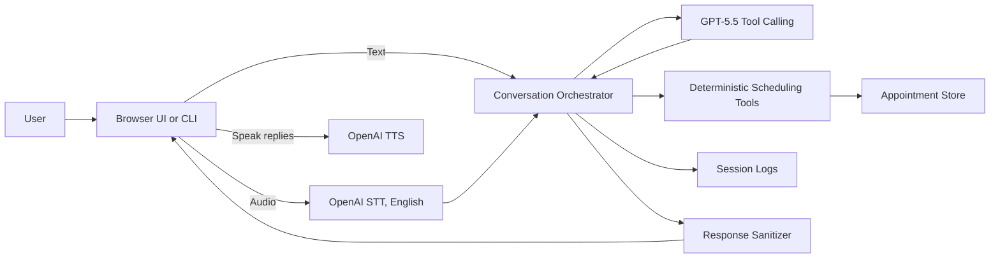
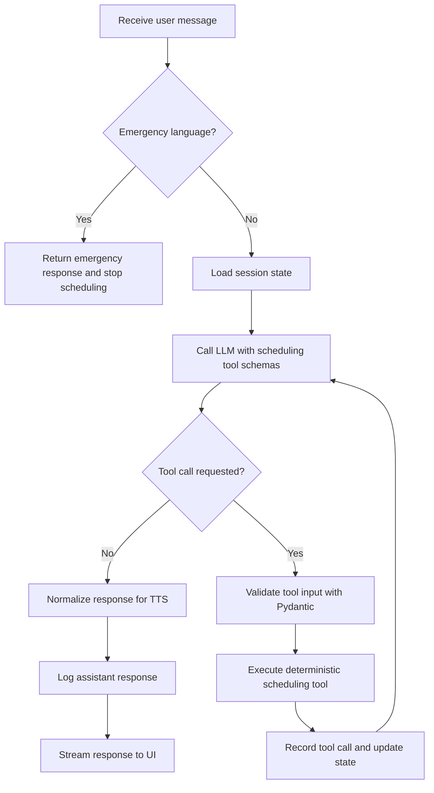

# Appointment Scheduling AI Agent

A production-style appointment scheduling assistant for booking, rescheduling, and canceling appointments using sample scheduling data. The LLM handles conversation, empathy, and deciding what information is missing. Deterministic typed tools handle all scheduling state changes, with validation and explicit confirmation required before booking, cancellation, or rescheduling.

This version intentionally uses OpenAI only:

- LLM: `gpt-5.5` by default
- STT: OpenAI transcription API
- TTS: OpenAI speech API
- No LangChain, LangGraph, LiveKit, Pipecat, Cartesia, or Deepgram
- Browser UI with typed chat, hold-to-talk voice, TTS playback, interruption, and streaming-style responses

## Architecture

```text
User text/audio
-> OpenAI STT if audio
-> Conversation Orchestrator
-> GPT-5.5 with tool calling
-> Deterministic scheduling tools
-> Store
-> Session logger
-> Response text
-> Streaming browser UI
-> OpenAI TTS if voice
```

Core boundary: the model can request tools, but it does not directly mutate appointments. The scheduling tools validate inputs, update state, and return structured outputs.





## Project Layout

```text
appointment_agent/
  app/
    api.py
    config.py
    main.py
    models.py
    openai_client.py
    orchestrator.py
    prompts.py
    sample_data.py
    scheduling_tools.py
    session_logger.py
    store.py
    stt_client.py
    text_utils.py
    tts_client.py
  docs/
    ARCHITECTURE.md
  scripts/
    run_cli.py
    run_voice.py
  tests/
    test_api.py
    test_orchestrator.py
    test_scheduling_tools.py
    test_text_utils.py
```

## Setup

```bash
cd /Users/amankumar/Documents/voice_ai/appointment_agent
python3.11 -m venv .venv
source .venv/bin/activate
pip install -r requirements.txt
cp .env.example .env
```

Edit `.env` and set:

```text
OPENAI_API_KEY=your_api_key
OPENAI_MODEL=gpt-5.5
OPENAI_STT_MODEL=gpt-4o-mini-transcribe
OPENAI_TTS_MODEL=gpt-4o-mini-tts
OPENAI_TTS_VOICE=alloy
SESSION_LOG_DIR=logs/sessions
APPOINTMENT_DATA_DIR=data
DEBUG=true
```

If `gpt-5.5` is not available in your account, keep the code unchanged and set `OPENAI_MODEL` to a model your account can use.

## Run The CLI

```bash
cd /Users/amankumar/Documents/voice_ai/appointment_agent
source .venv/bin/activate
python scripts/run_cli.py --debug
```

The CLI is a local text interface. It supports typed conversations and optional debug output showing tool calls and state summaries.

## Run The Browser App

```bash
cd /Users/amankumar/Documents/voice_ai/appointment_agent
source .venv/bin/activate
uvicorn app.api:app --host 127.0.0.1 --port 8001
```

Open:

```text
http://127.0.0.1:8001/
```

The browser UI supports:

- Typed chat
- Hold-to-talk microphone input
- English-only OpenAI transcription
- Spoken replies through OpenAI TTS
- Interrupt button for speech playback
- Streaming-style assistant responses
- Optional tool trace display

## Run The Voice File Runner

```bash
cd /Users/amankumar/Documents/voice_ai/appointment_agent
source .venv/bin/activate
python scripts/run_voice.py --audio sample.wav --out response.mp3
```

This transcribes an audio file in English, sends the text to the agent, and generates a speech response.

## Run The FastAPI Server

```bash
cd /Users/amankumar/Documents/voice_ai/appointment_agent
source .venv/bin/activate
uvicorn app.api:app --reload
```

Endpoints:

- `GET /`
- `GET /health`
- `POST /chat` with `{ "message": "...", "session_id": "..." }`
- `POST /chat/stream` with `{ "message": "...", "session_id": "..." }`
- `POST /speak` with `{ "text": "..." }`
- `POST /voice` with an uploaded audio file and `session_id`

## Run Tests

```bash
cd /Users/amankumar/Documents/voice_ai/appointment_agent
source .venv/bin/activate
python -m pytest -q
```

Tests do not require OpenAI API calls. The orchestrator tests use a mocked OpenAI client.

## Example Scenarios

Scenario 1: Happy path

User: “I need to schedule a cardiology appointment next Tuesday morning.”

Expected behavior: the agent acknowledges the request, asks for missing information, searches slots, offers choices, confirms details, and books only after explicit confirmation.

Scenario 2: Missing info

User: “I need an appointment.”

Expected behavior: the agent asks what type of appointment or specialty is needed.

Scenario 3: No availability

User asks for a specific provider/time with no slots.

Expected behavior: the agent says that slot is unavailable and offers alternatives or asks for a broader time.

Scenario 4: Reschedule

User gives an existing booking ID and asks to move it.

Expected behavior: the agent acknowledges the hassle, searches new slots, and confirms before rescheduling.

Scenario 5: Cancel

User asks to cancel.

Expected behavior: the agent confirms before canceling.

Scenario 6: Emergency

User says they have severe chest pain.

Expected behavior: the agent says exactly: “I’m sorry you’re experiencing that. I’m not able to handle emergencies. Please call emergency services or go to the nearest emergency room now.”

## Design Decisions

- Avoided LangChain for the first version to keep the system transparent and easy to debug.
- Kept deterministic scheduling logic separate from LLM orchestration.
- Used Pydantic schemas for validation and readable tool contracts.
- Required explicit confirmation for booking, cancellation, and rescheduling.
- Used a JSON-backed local scheduling store with sample appointment data.
- Added existing appointment lookup by booking ID or patient phone number.
- Added rule-based emergency detection before normal LLM scheduling.
- Isolated OpenAI LLM, STT, and TTS clients so providers can be swapped later.
- Normalized assistant text so TTS hears full weekday and month names.
- Logged session events as JSONL for debugging and technical review.

## Local Persistence

The application persists appointment state in local JSON files:

```text
data/
  slots.json
  bookings.json
```

This allows bookings and slot status to survive a server restart. Session logs are written separately under `logs/sessions/` and are used for audit and debugging, not as the operational booking store.

## Tradeoffs

- The default store is JSON-backed for local persistence, but it is not a substitute for a transactional production database.
- Date parsing is intentionally simple for the sample scheduling data.
- The CLI and API use the same orchestrator, but there is no authentication.
- Browser voice uses hold-to-talk audio uploads. Real-time voice transport is deferred.
- Streaming-style UI currently streams the completed assistant response after tool execution finishes.
- Emergency handling is keyword-based and conservative.
- Phone lookup is intended for existing appointment information, cancellation, and rescheduling support. A production system would add authentication before showing appointment details.

## Documentation

- Architecture writeup: `docs/ARCHITECTURE.md`
- Code walkthrough: `docs/CODE_WALKTHROUGH.md`

## Production Improvements

- Real EHR/scheduling integration
- Authentication
- HIPAA/security review
- Audit logging
- Human handoff
- Streaming STT/TTS
- Cartesia or other low-latency TTS provider
- Deepgram or another low-latency STT provider
- LiveKit/Pipecat for real-time voice transport
- Observability and tracing
- Evaluation harness
- Retry and timeout policies
- Better prompt and tool-call evals
- Multi-session persistence
- Calendar integration
- Provider availability integration
- Insurance eligibility checks

## Project Talking Points

- I intentionally avoided LangChain for the first version to keep the system transparent and easy to debug.
- The LLM handles conversation, but tools handle state-changing operations.
- Booking, cancellation, and rescheduling require explicit confirmation.
- Provider clients are separated from business logic, so OpenAI STT/TTS can later be replaced with Deepgram or Cartesia without changing the orchestrator.
- The agent is healthcare-adjacent, so empathy, safety, and deterministic validation matter.
- Emergency handling is rule-based and happens before normal scheduling.
- Tests avoid real API calls by mocking the OpenAI client.
- A production version would need authentication, audit logging, HIPAA/security review, human handoff, and integration with a real scheduling/EHR backend.
