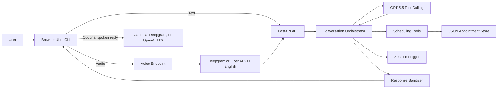
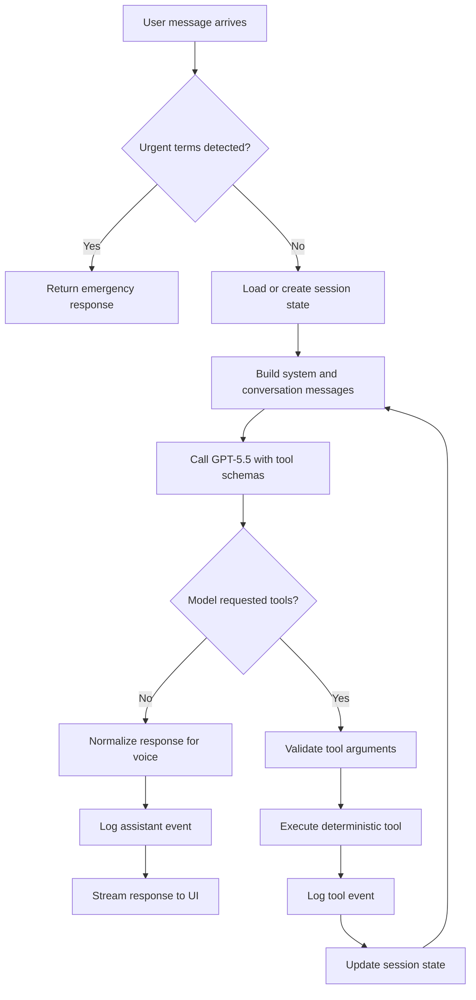
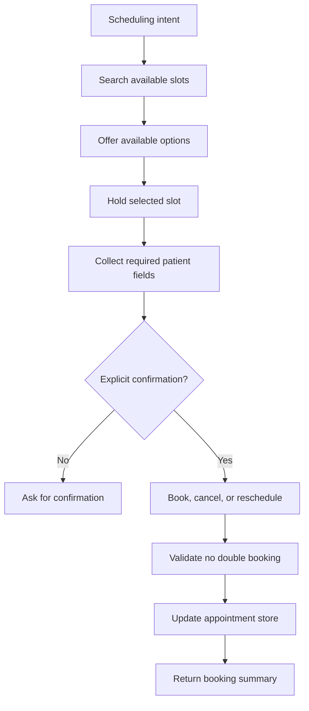

# Appointment Scheduling AI Agent Architecture

## Problem Statement

Healthcare appointment scheduling is conversational, stateful, and sensitive. A useful assistant must understand a patient's intent, ask for missing information, show empathy, and keep the conversation moving. At the same time, it must not let a language model directly mutate appointments, because booking, cancellation, and rescheduling require validation, auditability, and explicit confirmation.

This project builds a production-style appointment scheduling assistant that can schedule, reschedule, and cancel appointments through text and voice. The current implementation uses sample scheduling data so the system can run locally without connecting to a real scheduling backend.

## Solution Summary

The system uses OpenAI for language, transcription, and speech. A custom orchestrator manages conversation state and exposes deterministic scheduling tools to the model. The model decides what to ask or which tool to request, but all state-changing operations happen inside typed Python functions with validation.

Core principles:

- The LLM handles conversation, empathy, reasoning, and missing information.
- Tools handle booking, cancellation, rescheduling, and store mutation.
- Booking, cancellation, and rescheduling require explicit user confirmation.
- Urgency handling is regex-based and happens before the model is called.
- The browser UI supports text chat, hold-to-talk voice, TTS playback, and interruption.
- Tests do not call OpenAI.

## High-Level Flow

```text
User text or audio
-> Browser UI or CLI
-> Deepgram or OpenAI STT if audio
-> Conversation Orchestrator
-> GPT-5.5 with tool calling
-> Deterministic scheduling tools
-> JSON-backed appointment store
-> Response sanitizer
-> Session logger
-> Response text
-> Streaming-style UI updates
-> Cartesia, Deepgram, or OpenAI TTS if speech playback is enabled
```



## Orchestrator Flow



## Scheduling Tool Flow



## Main Components

### Browser UI

The root FastAPI page provides the interactive product surface:

- Typed chat input
- Hold-to-talk microphone recording
- Spoken assistant replies
- Interrupt button to stop speech playback
- Optional tool trace display
- Clear button

The UI calls:

- `POST /chat/stream` for streaming-style text responses
- `POST /voice` for audio input
- `POST /speak` for TTS audio output

### FastAPI API

The API layer is intentionally thin. It validates request shapes, forwards work to the orchestrator or OpenAI audio clients, and returns structured responses.

Endpoints:

- `GET /`
- `GET /health`
- `POST /chat`
- `POST /chat/stream`
- `POST /voice`
- `POST /speak`

### Orchestrator

The orchestrator owns conversation state per session. It sends messages to the OpenAI LLM with tool schemas and executes requested tools in a bounded loop.

Responsibilities:

- Maintain session state
- Detect emergencies before model calls
- Call the LLM with tool definitions
- Execute deterministic tools
- Record tool calls
- Normalize model output for TTS
- Log session events

### Scheduling Tools

The scheduling tools are deterministic Python functions. They are the only code allowed to mutate appointment state.

Tools:

- `list_specialties`
- `search_available_slots`
- `search_provider_slots`
- `hold_slot`
- `book_appointment`
- `get_booking`
- `search_bookings_by_phone`
- `cancel_appointment`
- `reschedule_appointment`

Safety rules:

- Search only returns available, non-booked slots.
- Provider lookup uses fuzzy matching and can infer specialty from the provider's slot data.
- Booking requires name, phone number, reason, and explicit confirmation.
- Cancellation requires explicit confirmation.
- Rescheduling requires explicit confirmation.
- The same slot cannot be double-booked.
- Existing appointments can be retrieved by booking ID or phone number.
- Tool errors are structured and controlled.

### Store

The default backend is a JSON-backed local scheduling store with sample appointment data. It persists slot status and bookings under `data/slots.json` and `data/bookings.json`, which allows appointments to survive a server restart without requiring an external database.

The in-memory store remains available for focused unit tests.

Production replacement options:

- EHR scheduling API
- Calendar availability API
- Relational database
- Appointment hold service with expiration
- Durable audit log

### Provider Clients

Provider usage is isolated behind small adapters:

- `openai_client.py` for LLM calls
- `stt_client.py` for Deepgram or OpenAI transcription
- `tts_client.py` for Cartesia, Deepgram, or OpenAI speech generation

This keeps provider details away from business logic. STT or TTS can be replaced without rewriting the orchestrator.

### Text Normalization

The app normalizes assistant responses before returning them:

- Expands weekdays like Friday instead of Fri
- Expands months like June instead of Jun
- Replaces dash ranges with the word `to`
- Removes em dash and en dash characters

This improves TTS pronunciation and keeps the UI consistent.

### Session Logging

Each session writes JSONL events under `logs/sessions`:

- User messages
- Assistant messages
- Tool calls

This is useful for debugging, product review, and technical review. In production, logging would need privacy controls, retention policies, encryption, access controls, and compliance review.

Session logs are separate from the operational booking store. Bookings are retrieved from the JSON appointment store, not reconstructed from logs.

## Streaming Design

The browser uses `POST /chat/stream` to render assistant text progressively. The current implementation streams the final assistant message after deterministic tool execution finishes. This gives the user a smoother ChatGPT-like experience while preserving the safety boundary around tool calls.

A production version could add true token streaming from the LLM and handle tool-call phases explicitly:

1. Stream initial assistant reasoning or acknowledgement.
2. Pause for tool execution.
3. Stream the final answer after tool results.

The current design is simpler and easier to explain in a technical walkthrough.

## Urgency Handling

Urgency detection happens before the LLM is called. If the user mentions severe chest pain, trouble breathing, severe bleeding, stroke symptoms, suicidal ideation, excruciating pain, injury, accident, or another life-threatening concern, the assistant returns the 911 response and stops scheduling.

This is rule-based by design because safety-critical routing should not depend only on model behavior.

## Failure Scenarios

Potential failures and current behavior:

- Missing OpenAI API key: clear runtime error for API-backed paths
- Tool validation error: controlled structured error returned to the model
- No slots available: assistant offers alternatives
- Voice upload fetch failure: browser retries once
- TTS unavailable: text response remains visible
- Urgent input: scheduling is bypassed

## Production Improvements

Important additions before production:

- Authentication
- HIPAA and security review
- Real EHR or scheduling integration
- Audit logging with access controls
- Human handoff
- Observability and tracing
- Retry and timeout policies
- Streaming STT and TTS
- Low-latency voice transport
- Evaluation harness
- Prompt and tool-call regression tests
- Persistent multi-session storage
- Calendar integration
- Provider availability integration
- Insurance eligibility checks

## Project Talking Points

- I avoided LangChain in the first version so the architecture is transparent and debuggable.
- The LLM owns conversation, not appointment mutation.
- Deterministic tools own validation and state changes.
- Explicit confirmation is required before booking, cancellation, or rescheduling.
- Urgency handling is regex-based and happens before normal scheduling.
- OpenAI clients are isolated so STT and TTS providers can be swapped later.
- Session logs and tool traces make the system auditable.
- Tests avoid real API calls by mocking model behavior.
