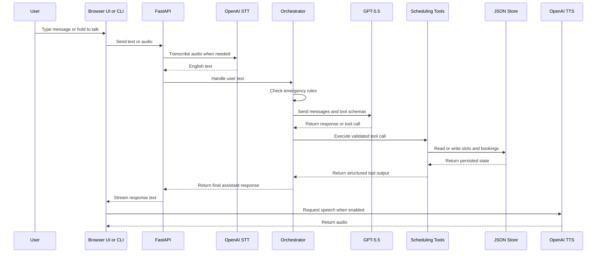

# Code Walkthrough

This document explains how the appointment scheduling assistant works from input to output. It is intentionally separate from the source code so the implementation stays readable while the system remains easy to understand.

## Runtime Flow



## Top-Level Files

### `README.md`

The README is the public entry point for the project. It explains setup, the browser app, command-line usage, API endpoints, local persistence, design decisions, tradeoffs, and production improvements.

### `.env.example`

This file lists environment variables required by the app. It documents OpenAI model settings, the local appointment data directory, the session log directory, and debug mode.

### `.gitignore`

This keeps secrets, virtual environments, generated audio, session logs, local JSON data, and private presentation files out of version control.

### `requirements.txt`

This defines Python dependencies. The app uses FastAPI, OpenAI, Pydantic, python-dotenv, uvicorn, and pytest.

## Application Package

### `app/__init__.py`

This marks `app` as a Python package. It does not need runtime logic.

### `app/config.py`

This module loads environment configuration with Pydantic settings.

Important settings:

- `OPENAI_API_KEY` supplies OpenAI authentication.
- `OPENAI_MODEL` controls the LLM model.
- `OPENAI_STT_MODEL` controls transcription.
- `OPENAI_TTS_MODEL`, `OPENAI_TTS_VOICE`, and `OPENAI_TTS_SPEED` control speech output.
- `APPOINTMENT_DATA_DIR` controls where JSON appointment state is stored.
- `SESSION_LOG_DIR` controls where session logs are written.

`get_settings()` caches settings so the app does not repeatedly parse environment variables.

### `app/models.py`

This module defines the typed data contracts for the system.

Key models:

- `PatientInfo` validates patient name and phone number.
- `AppointmentSlot` represents a provider availability slot.
- `AppointmentBooking` represents a booked appointment.
- Tool input and output models validate scheduling operations.
- `ConversationState` tracks active session state.
- `ToolCallRecord` records deterministic tool activity.
- `AgentResponse` is the API-facing response from the orchestrator.

These models make the scheduling assistant predictable because invalid data fails validation before it can mutate appointment state.

### `app/sample_data.py`

This module creates sample appointment slots for local development.

It defines supported specialties and creates provider availability for primary care, cardiology, dermatology, pediatrics, and physical therapy.

### `app/store.py`

This module contains the appointment persistence layer.

`InMemoryAppointmentStore` is a lightweight store used mainly for focused tests.

`JsonAppointmentStore` is the default runtime store. It persists:

```text
data/slots.json
data/bookings.json
```

Important methods:

- `list_slots()` returns all slots.
- `get_slot()` retrieves one slot.
- `save_slot()` persists slot state changes.
- `add_booking()` saves a new booking.
- `get_booking()` retrieves a booking by booking ID.
- `save_booking()` persists booking updates.
- `reset()` restores sample slot data.

`create_default_store()` constructs the JSON-backed store used by the orchestrator.

### `app/scheduling_tools.py`

This module contains deterministic business logic. These tools are the only code allowed to mutate scheduling state.

Main tools:

- `list_specialties()` returns supported appointment specialties.
- `search_available_slots()` filters open slots by specialty, date, time window, and provider.
- `search_provider_slots()` fuzzy-matches a provider name and infers specialty from matching slot data.
- `hold_slot()` marks a selected slot as held.
- `book_appointment()` validates required fields and explicit confirmation before booking.
- `get_booking()` retrieves an appointment by booking ID.
- `search_bookings_by_phone()` retrieves already scheduled appointments by patient phone number.
- `cancel_appointment()` requires explicit confirmation before cancellation.
- `reschedule_appointment()` requires explicit confirmation before moving a booking to a new slot.

The scheduling tools protect the system from unsafe model behavior. The LLM can request a tool call, but the tool decides whether the action is valid.

### `app/prompts.py`

This module contains the system prompt and emergency response.

The prompt defines:

- Assistant role
- Scheduling scope
- Safety boundaries
- English-only response style
- Explicit confirmation rules
- TTS-friendly wording rules

The emergency response is centralized so tests and runtime behavior use the same exact text.

### `app/openai_client.py`

This is a small wrapper around the OpenAI LLM call.

It keeps OpenAI SDK details isolated from the orchestrator. If the app later changes model settings or provider implementation, this file is the main place to update.

### `app/stt_client.py`

This module handles speech-to-text.

`transcribe_audio()` opens an audio file, sends it to OpenAI transcription, and returns English text. This happens before the orchestrator receives the user input.

### `app/tts_client.py`

This module handles text-to-speech.

`synthesize_speech()` writes speech audio to a file for the voice runner.

`synthesize_speech_bytes()` returns audio bytes for the browser `/speak` endpoint. Both paths use the configured speech speed so browser replies and file replies stay consistent.

### `app/text_utils.py`

This module makes assistant responses friendlier for speech output.

`normalize_for_voice()` expands weekday and month abbreviations and removes TTS-unfriendly dash characters. This keeps spoken responses clearer.

### `app/session_logger.py`

This module writes append-only JSONL logs for each session.

Logged events include:

- User messages
- Assistant messages
- Tool calls

Session logs are for debugging and audit-style review. Operational booking retrieval uses the appointment store, not logs.

### `app/orchestrator.py`

This is the custom agent implementation.

Main responsibilities:

- Maintain per-session conversation state.
- Check emergency rules before model calls.
- Send conversation messages and tool schemas to GPT-5.5.
- Parse model tool calls.
- Execute deterministic scheduling tools.
- Feed tool results back into the model.
- Normalize the final assistant response.
- Log user, assistant, and tool events.

The orchestrator is single-agent. It uses tools, but the tools are deterministic functions, not separate agents.

The loop is bounded to avoid infinite tool cycles. If the model keeps asking for tools, the orchestrator stops after a fixed number of iterations and returns a fallback message.

### `app/api.py`

This module exposes the FastAPI application and browser UI.

Important endpoints:

- `GET /` serves the browser chat UI.
- `GET /health` checks server health.
- `POST /chat` returns a normal JSON response.
- `POST /chat/stream` streams assistant text to the browser.
- `POST /voice` accepts audio, transcribes it, and sends the text to the orchestrator.
- `POST /speak` converts assistant text into speech audio.

The browser UI supports typed chat, hold-to-talk voice input, spoken replies, tool trace display, and speech interruption.

### `app/main.py`

This is a small entry point for creating the agent from Python. It is useful for quick local checks.

## Scripts

### `scripts/run_cli.py`

This is a terminal interface to the same orchestrator used by the browser app.

It accepts typed messages and optionally prints debug information like tool calls and state summaries.

### `scripts/run_voice.py`

This is an audio-file runner.

It transcribes an audio file, sends the transcription to the orchestrator, and writes a speech response to an output file.

## Tests

### `tests/conftest.py`

This ensures tests import the local `app` package instead of any unrelated package named `app` installed in the Python environment.

### `tests/test_scheduling_tools.py`

This validates deterministic scheduling behavior.

It checks search, specialty filtering, provider filtering, provider fuzzy lookup, booking validation, double-book prevention, cancellation, rescheduling, and JSON persistence across store instances.

### `tests/test_orchestrator.py`

This validates agent behavior without calling OpenAI.

It uses a mock OpenAI client to test missing-information handling, empathetic tone, urgency short-circuiting, and TTS-friendly response normalization.

### `tests/test_api.py`

This validates the API and browser UI surface.

It checks that the root page contains interactive controls and that `/chat/stream` returns server-sent events.

### `tests/test_text_utils.py`

This validates text normalization for speech output.

It checks that abbreviated dates are expanded and dash characters are removed from assistant responses.

## Key Design Choices

### Custom Agent Instead Of A Framework

The agent is implemented directly in `app/orchestrator.py`. This keeps the control flow transparent and makes tool execution easy to audit.

### Tools Own State Changes

The LLM never directly books, cancels, or reschedules. It can only request a tool call, and the deterministic tool validates whether the action is allowed.

Existing appointment lookup follows the same pattern. The LLM can ask for a phone number, but appointment retrieval happens through `search_bookings_by_phone()` rather than model memory.

### JSON Store For Local Persistence

The app persists slots and bookings in JSON files so appointment state survives server restarts without requiring a database.

### Separate Session Logs

Session logs are append-only records of conversation events. They are separate from operational appointment data.

### English-Only Voice Input

OpenAI transcription is configured with English as the language. The prompt also instructs the assistant to respond only in English.

### TTS-Friendly Output

The app normalizes assistant text before returning it to the user so speech output is easier to understand.

## End-To-End Example

```text
User: I need a cardiology appointment next Tuesday morning.
Browser UI: Sends text to /chat/stream.
API: Passes message to the orchestrator.
Orchestrator: Calls GPT-5.5 with scheduling tools.
LLM: Requests search_available_slots.
SchedulingTools: Searches the JSON-backed slot store.
Orchestrator: Sends tool result back to GPT-5.5.
LLM: Produces a user-facing response with available slots.
Response sanitizer: Expands dates and removes speech-unfriendly punctuation.
API: Streams response to the browser.
Browser UI: Displays text and optionally plays TTS.
```
