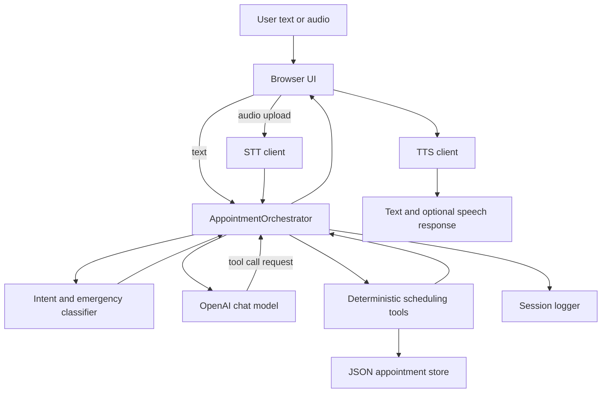

# Appointment Scheduling Assistant Implementation

## Problem Statement

The project builds a voice-capable appointment scheduling assistant that can help a user book, reschedule, cancel, and look up appointments. The assistant needs to feel calm and helpful, but it must not directly mutate scheduling state through free-form model text.

The key design requirement is separation of responsibilities:

- The language model handles conversation, empathy, clarification, and tool selection.
- Deterministic Python tools handle booking, cancellation, rescheduling, lookup, and validation.
- State-changing actions require explicit confirmation.
- Emergency handling runs before normal scheduling.
- Audio providers are isolated behind STT and TTS clients so they can be swapped without rewriting the orchestrator.

## High-Level Architecture



## Request Flow

### Text Turn

1. The browser sends `{ message, session_id }` to `/chat/stream`.
2. `AppointmentOrchestrator.handle_message()` loads or creates the session state.
3. The latest user text is classified by `classify_intent()`.
4. Emergency rules run before normal scheduling.
5. If safe, the orchestrator builds a bounded prompt with system policy, latest intent, compact state, and recent conversation.
6. The OpenAI client streams the configured chat model with strict tool schemas.
7. If the model asks for a tool, the orchestrator assembles the streamed tool call, validates it, and dispatches it.
8. The deterministic tool reads or mutates the appointment store.
9. Tool output is returned to the model so the model can produce a user-facing answer.
10. The final response is normalized for voice and logged.
11. The browser renders text and optionally speaks it.

### Voice Turn

1. The user holds the microphone button.
2. The browser records audio using `MediaRecorder`.
3. Audio is uploaded to `/voice`.
4. `transcribe_audio()` selects the STT provider by configuration.
5. The transcription is passed to the same orchestrator used for text.
6. The browser receives the text response.
7. If auto-speak is enabled, the browser tries `/speak/stream` first.
8. If streaming TTS is unavailable, the browser falls back to `/speak`.

The async FastAPI voice and chat-stream routes offload blocking STT, LLM, and optional file-based TTS work with `asyncio.to_thread()`. That keeps the event loop responsive while provider SDK calls and deterministic tool execution run in worker threads.

## Core Components

### `app/api.py`

This is the FastAPI entry point and browser UI host.

Main responsibilities:

- Serve the browser interface at `/`.
- Accept text chat at `/chat`.
- Accept SSE-style chat responses at `/chat/stream`.
- Accept audio upload at `/voice`.
- Generate complete TTS audio at `/speak`.
- Stream Cartesia TTS chunks at `/speak/stream` when configured.
- Provide `/health` for smoke checks.

The embedded browser UI supports:

- Text input.
- Hold-to-talk voice input.
- Speech interruption.
- Initial spoken greeting.
- Optional tool-trace debug output.
- Streaming TTS playback through Web Audio when Cartesia streaming is available.

### `app/orchestrator.py`

This is the central custom agent loop. It is intentionally small and transparent.

Main responsibilities:

- Maintain per-session `ConversationState`.
- Run emergency handling before normal model calls.
- Run intent classification on every user turn.
- Build a bounded LLM prompt.
- Expose strict OpenAI tool schemas.
- Execute model-requested tool calls.
- Keep deterministic tools as the only state-mutating path.
- Track tool calls for debugging.
- Normalize assistant text for voice output.

The orchestrator is a single-agent system. It uses one conversation agent with tools, not multiple specialized agents.

### `app/intent_classifier.py`

This module is a fast rule-based classifier that runs before the LLM.

It classifies each turn into:

- `book`
- `reschedule`
- `cancel`
- `confirm_lookup`
- `question`
- `out_of_scope`
- `emergency`
- `unclear`

It also extracts:

- Specialty.
- Provider.
- Raw date phrase.
- Whether the patient appears to be the caller.

This classifier does not book or cancel anything. It only gives routing context to the orchestrator and model.

### `app/scheduling_tools.py`

This module contains the deterministic business logic. It is the safety boundary for appointments.

Tools include:

- `list_specialties()`
- `search_available_slots()`
- `search_provider_slots()`
- `hold_slot()`
- `book_appointment()`
- `get_booking()`
- `search_bookings_by_phone()`
- `cancel_appointment()`
- `reschedule_appointment()`

Important rules:

- Search returns only available and non-booked slots.
- Booking requires name, phone number, reason, selected slot, and explicit confirmation.
- Cancellation requires explicit confirmation.
- Rescheduling requires explicit confirmation.
- Double-booking is blocked.
- Lookup responses include user-facing appointment details and avoid internal slot IDs.
- Provider search uses fuzzy matching and can infer specialty from a doctor name.

### `app/store.py`

This module provides appointment persistence.

There are two store types:

- `InMemoryAppointmentStore`, mainly for focused tests.
- `JsonAppointmentStore`, the default runtime store.

The JSON store persists:

```text
data/slots.json
data/bookings.json
```

Runtime mutations update memory immediately, then queue a coalesced background JSON flush. This keeps the request path faster while still allowing appointment state to survive server restarts. Tests and shutdown can force persistence through `flush()`.

### `app/models.py`

This module defines the Pydantic data contracts used across the project.

Important models:

- `PatientInfo`
- `AppointmentSlot`
- `AppointmentBooking`
- `AppointmentRequest`
- `IntentClassification`
- `SearchSlotsInput`
- `SearchSlotsOutput`
- `AppointmentDetail`
- `BookAppointmentInput`
- `BookAppointmentOutput`
- `CancelAppointmentInput`
- `CancelAppointmentOutput`
- `RescheduleAppointmentInput`
- `RescheduleAppointmentOutput`
- `ConversationState`
- `ToolCallRecord`
- `AgentResponse`

Pydantic validation keeps malformed tool inputs from becoming silent state changes.

### `app/openai_client.py`

This is the LLM adapter.

It isolates the rest of the codebase from OpenAI SDK details. The orchestrator calls `call_llm()` and does not need to know how the SDK client is created.

The model comes from:

```text
OPENAI_MODEL
```

The documented default in code is configurable, and the local `.env` can override it.

### `app/stt_client.py`

This module handles speech-to-text.

Provider selection is controlled by:

```text
AUDIO_STT_PROVIDER
```

Supported values:

- `auto`
- `deepgram`
- `openai`

In `auto`, Deepgram is preferred if configured. OpenAI remains available as a fallback when enabled. English transcription is forced in both supported provider paths.

### `app/tts_client.py`

This module handles text-to-speech.

Provider selection is controlled by:

```text
AUDIO_TTS_PROVIDER
```

Supported values:

- `auto`
- `cartesia`
- `deepgram`
- `openai`

In `auto`, provider order is:

1. Cartesia when configured.
2. Deepgram when configured.
3. OpenAI.

Cartesia supports a streaming SSE path through `/speak/stream`. The browser schedules raw PCM chunks with Web Audio so playback can start earlier than complete-file TTS.

### `app/session_logger.py`

This module writes append-only JSONL session logs under:

```text
logs/sessions/
```

The logger records:

- User turns.
- Intent classification.
- Tool calls.
- Assistant responses.

Logging is done by a background writer so normal request handling is not blocked by disk I/O.

### `app/text_utils.py`

This module makes assistant text more voice-friendly.

It expands weekday and month abbreviations, removes dash-like punctuation, normalizes spacing, and helps TTS read responses more naturally.

### `app/sample_data.py`

This module creates local sample appointment slots.

It includes:

- Primary care.
- Cardiology.
- Dermatology.
- Pediatrics.
- Physical therapy.

Dates are generated relative to the current date so the local app always has near-future sample availability.

### `scripts/run_cli.py`

This is a text-only local runner.

It creates an orchestrator, accepts typed messages, prints assistant responses, and can show debug tool traces with `--debug`.

### `scripts/run_voice.py`

This is an audio-file runner.

It transcribes an audio file, sends the transcription to the orchestrator, then writes the assistant response as synthesized speech.

## Confirmation and Safety Design

The model can ask to call tools, but the tools enforce the final rules.

Booking requires:

- Slot ID.
- Patient name.
- Phone number.
- Appointment reason.
- Explicit confirmation.

Cancellation requires:

- Booking ID.
- Explicit confirmation.
- Optional patient-name match.

Rescheduling requires:

- Existing booking ID.
- New slot ID.
- Explicit confirmation.

This means the assistant can have natural conversation, but appointment state changes still go through deterministic validation.

## Emergency Handling

Emergency detection runs before normal scheduling.

If the user mentions urgent phrases such as chest pain, trouble breathing, severe bleeding, stroke symptoms, suicidal ideation, excruciating pain, serious fall, injury, or accident, the assistant returns:

```text
I’m sorry you’re experiencing that. I’m not able to handle emergencies. Please call 911 now.
```

The session enters emergency mode and does not continue scheduling unless the user clarifies that it is not an emergency.

There are two emergency checks on purpose:

- The intent classifier marks obvious urgent messages as `emergency`.
- The orchestrator also runs `is_emergency()` directly as a safety backstop before calling the LLM.

Emergency mode is intentionally reversible when the user clearly corrects the situation, such as saying they are all right, it was a mistake, it was a false alarm, they were kidding, or the pain/injury is minor and they want routine scheduling. This avoids trapping a corrected conversation in the emergency state.

## Provider and Specialty Matching

The system handles common ways users ask for appointments:

- "dermatologist" maps to Dermatology.
- "dermitalogist" maps to Dermatology.
- "skin doctor" maps to Dermatology.
- "cardiologist" maps to Cardiology.
- "pediatrician" maps to Pediatrics.
- "physical therapist" maps to Physical therapy.

If the user asks for a specific doctor, `search_provider_slots()` fuzzy-matches provider names and infers the specialty from that provider's slots.

## Existing Appointment Lookup

Users can look up existing scheduled appointments by booking reference or phone number.

Phone lookup uses digits only, so formats like these can match the same stored number:

```text
9193496712
(919) 349-6712
919 349 6712
```

Lookup responses include provider, specialty, location, time, patient name, reason, status, and booking reference. Internal slot IDs are not meant for user-facing speech.

## Latency Work Already Implemented

Several request-path latency improvements are in place:

- `/chat/stream` no longer adds artificial word delay.
- The LLM client can stream text deltas and assembled tool calls.
- LLM history is bounded to recent conversation.
- Session logs write in the background.
- JSON appointment-store writes are coalesced in the background.
- OpenAI audio clients are cached.
- Duplicate tool-call serialization is avoided.
- Specialty fuzzy matching is bounded.
- Cartesia streaming TTS can begin playback before a complete audio file is ready.

The largest remaining latency improvements are:

- Sentence-level TTS pipelining, where speech begins after the first complete generated sentence.
- A real-time voice transport layer instead of file upload.

## Data Persistence

Operational appointment state is stored in JSON files. Session logs are separate and are not used as the source of truth for appointments.

This distinction matters:

- Appointment lookup reads from `data/bookings.json` and `data/slots.json`.
- Debug history reads from `logs/sessions/`.

In a production deployment, JSON should be replaced by a transactional database or scheduling API.

## Testing Strategy

The test suite validates the deterministic and agent-facing behavior without real provider calls.

Coverage includes:

- Slot search.
- Specialty filtering.
- Provider fuzzy search.
- Relative date handling.
- Alternative slot behavior.
- Booking required fields.
- Explicit confirmation.
- Slot status changes.
- Double-book prevention.
- Cancellation.
- Rescheduling.
- Booking lookup by phone.
- Voice-friendly booking details.
- Intent classification.
- Emergency routing.
- Orchestrator history bounds.
- API basics.
- Audio provider client behavior with mocks.

## Production Readiness Notes

The current system is intentionally local and explainable. A production version would add:

- Authentication.
- Role-based access control.
- Encryption at rest and in transit.
- Strong audit logging and retention policies.
- Real scheduling or EHR integration.
- Transactional database.
- Human handoff.
- Observability and tracing.
- Rate limits and retry policies.
- Timeouts around provider calls.
- Real-time voice transport.
- Evaluation datasets for prompts, tools, and safety behavior.
- Better date parsing.
- Calendar and provider availability integration.
- Insurance and eligibility integration when required.

## How to Explain the Design

The simplest explanation is:

1. Audio becomes text through STT.
2. Text goes to one orchestrator.
3. Emergency and intent checks happen first.
4. The LLM decides what to say or which tool to call.
5. Tools validate and mutate appointment state.
6. The store persists slots and bookings.
7. The assistant response returns as text.
8. TTS optionally speaks the response.

The key point is that the LLM is allowed to reason, but not allowed to directly change appointments. All state changes go through typed tools with validation and explicit confirmation.
